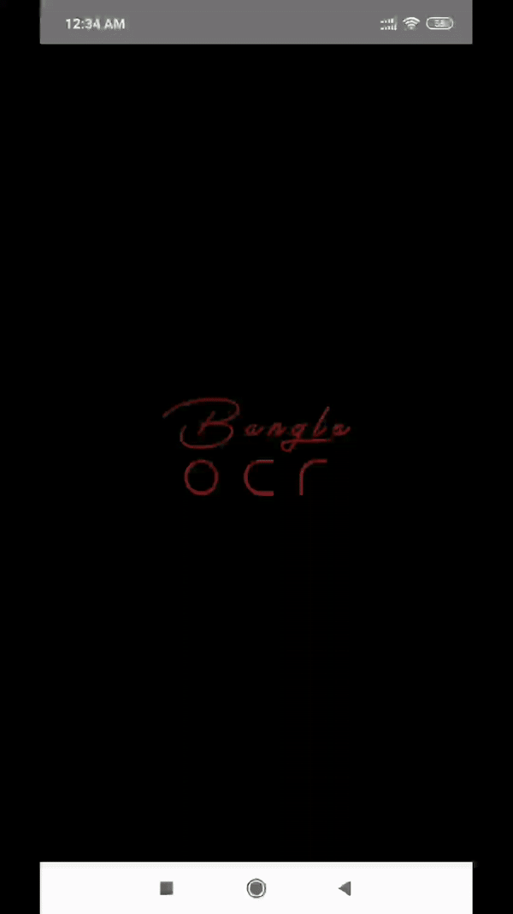

# BanglaOCR(digit recognition) with TensorFlow Lite on Android

This project was built as a lab task for the software development corse (CSE 4510) in IUT (Islamic University of Technology). The project uses [TensorFlow Lite](https://www.tensorflow.org/lite) on Android for Bangla handwritten digits classification.
Download the apk of the app from the [google playstore](https://play.google.com/store/apps/details?id=com.orangekid.banglaocr). 
A detailed report on the app is available [here](https://drive.google.com/open?id=1P7wIzQh38fIubXCW74GiRJSmGIBxPwI8).

    

Bangladesh is lagging behind in machine learning. A good OCR software for Bengali text recognition is really hard to find. In this project our goal is to create a system that can lead to an excellent OCR software for Bengali text recognition.
To start the system, our plan was to create OCR for Bengali digits only. The android application also has scopes for further development. The application can collect data from the user to create new datasets.
The project root directory has the dataset finalModelX and the corresponding labels finalModelY. MyModel2.ipynb is one of the neural network models used in the application.

### Contributors
- Md. Mushfiqur Rahman (160041011)[Gitlab](https://gitlab.com/mushfiqur11)
    - Machine Learning Implementation
- Kazi Raiyan Mahmud (160041058)[Gitlab](https://gitlab.com/kazzi58)
    - Android Development
- Minhajul Islam (160041061)[Gitlab](https://gitlab.com/Minhaj91)
    - Data Collection and U/I design

### Environment
- OpenCV for data manipulation
- Python 3.6, TensorFlow 1.13.1 for model creation
- Tensorflow Lite to make the model deployable to Android
- Android Studio to make the Android application

### Credits
- The dataset used for training the model was prepared by the students. It was merged with dataset downloaded from [numta-dataset](https://github.com/BengaliAI/Numta)
- The basic model architecture comes from [tensorflow-mnist-tutorial](https://github.com/GoogleCloudPlatform/tensorflow-without-a-phd/tree/master/tensorflow-mnist-tutorial).
- The official TensorFlow Lite [examples](https://github.com/tensorflow/examples/tree/master/lite/examples).
- The [FingerPaint](https://android.googlesource.com/platform/development/+/master/samples/ApiDemos/src/com/example/android/apis/graphics/FingerPaint.java) from Android API demo.

    

